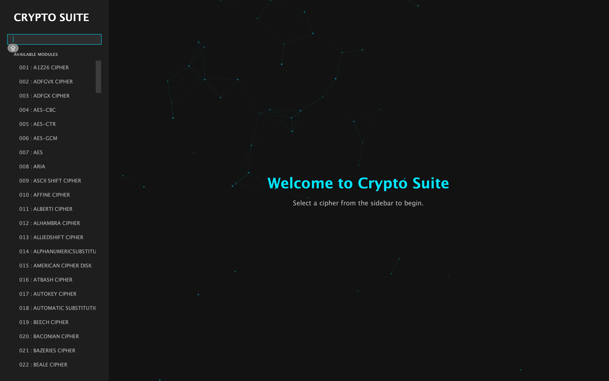

# 🔐 Cryptography Suite

A comprehensive Java-based application for exploring and using various cryptographic ciphers and tools.

## 📸 Screenshots


*The Cryptography Suite Interface*


## 🚀 How to Run

### Mac / Linux (Recommended)
We have included a helper script to automatically set up the environment and launch the app.
```bash
./launch.sh
```

### Manual Compilation
If you prefer to run it manually, ensure you have Java installed (JDK 8+).

```bash
# Compile
javac CryptoApp.java

# Run
java CryptoApp
```

## 🧩 Features
This suite includes a wide range of ciphers, including:
- **Classical Ciphers:** Caesar, Vigenère, Playfair, Affine, Atbash
- **Modern Ciphers:** AES, DES, Blowfish, RC4, RSA
- **Hashing:** SHA, MD5
- **Transposition:** Columnar, Rail Fence
- **Steganography & More!**

## 🛠 Requirements
- Java Development Kit (JDK) 8 or higher
- (On Mac) Homebrew is recommended for installing OpenJDK if missing.

---
*Created for educational and practical cryptography exploration.*
